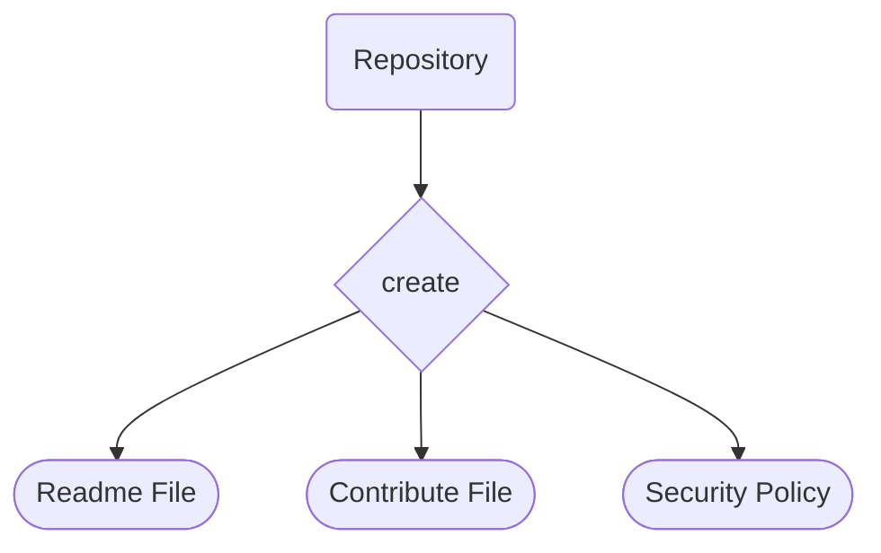
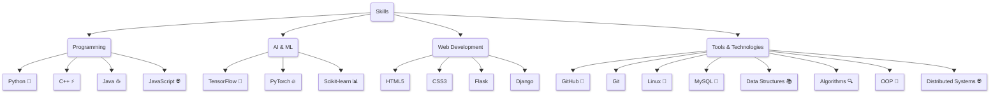

```mermaid
graph TB
A(Repository)-->B{create}-->C([Readme File])
B-->D([Contribute File]) & E([Security Policy])

```

```mermaid
---
config:
  theme: mc
  look: neo
  layout: dagre
---
flowchart TB
    A("Skills") --> B("Programming") & C("AI & ML") & D("Web Development") & E("Tools & Technologies")
    B --> B1["Python 🐍"] & B2["C++ ⚡"] & B3["Java ☕"] & B4["JavaScript 🌐"]
    C --> C1["TensorFlow 🧠"] & C2["PyTorch 🔥"] & C3["Scikit-learn 📊"]
    D --> D1["HTML5"] & D2["CSS3"] & D3["Flask"] & D4["Django"]
    E --> E1["GitHub 📂"] & E2["Git"] & E3["Linux 🐧"] & E4["MySQL 💾"] & E5["Data Structures 📚"] & E6["Algorithms 🔍"] & E7["OOP 🎯"] & E8["Distributed Systems 🌐"]
```