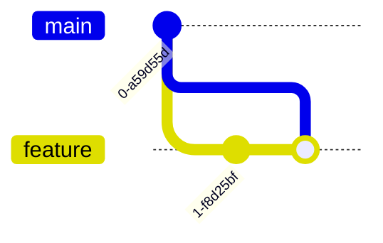

Certainly! Let’s dive into **Mermaid.js**, a powerful tool for creating diagrams using simple text syntax. I’ll explain **all supported diagram types**, their purposes, syntax examples, and the underlying theory. 📊

---

### **1. Flowchart**
**Purpose**: Visualize processes, workflows, or algorithms.  
**Syntax**:

**Theory**:  
- Uses **nodes** (shapes like rectangles, diamonds) and **edges** (arrows).  
- Direction: `TD` (top-down), `LR` (left-right), `RL`, `BT`.  
- Supports subgraphs, styling, and labels.  

---

### **2. Sequence Diagram**
**Purpose**: Model interactions between entities over time.  
**Syntax**:

**Theory**:  
- **Actors** (participants) communicate via **messages** (`->>`, `-->>`).  
- **Activation bars** show when an actor is active.  
- Supports loops, conditionals, and parallel flows.  

---

### **3. Class Diagram** (UML)
**Purpose**: Represent object-oriented systems (classes, relationships).  
**Syntax**:

**Theory**:  
- **Classes** with attributes/methods.  
- Relationships: `inheritance` (`<|--`), `composition` (`*--`), `aggregation` (`o--`).  

---

### **4. State Diagram**
**Purpose**: Show states and transitions in a system.  
**Syntax**:

**Theory**:  
- **States** (circles) connected by **transitions** (arrows).  
- Supports nested states, forks, and history states.  

---

### **5. Entity-Relationship Diagram (ERD)**
**Purpose**: Design database schemas.  
**Syntax**:

**Theory**:  
- **Entities** (tables) linked by **relationships** (crow’s foot notation).  
- Cardinality: `1:1`, `1:N`, `M:N`.  

---

### **6. User Journey Diagram**
**Purpose**: Map user interactions with a system.  
**Syntax**:

**Theory**:  
- **Phases** (sections) with **tasks** and **emotional scores** (1-5).  

---

### **7. Gantt Chart**
**Purpose**: Plan project timelines.  
**Syntax**:

**Theory**:  
- **Tasks** with start dates/durations.  
- Dependencies: `after` keyword.  

---

### **8. Pie Chart**
**Purpose**: Visualize data proportions.  
**Syntax**:

**Theory**:  
- Simple key-value pairs for slices.  

---

### **9. Requirement Diagram**
**Purpose**: Model system requirements.  
**Syntax**:
```mermaid
requirementDiagram
    requirement req1 {
        id: 1
        text: "User login"
        risk: High
    }
    element component1
    req1 -> component1
```
**Theory**:  
- **Requirements** linked to **components** or **design elements**.  

---

### **10. Git Graph**
**Purpose**: Visualize Git commit history.  
**Syntax**:

**Theory**:  
- **Commits**, **branches**, and **merges** in a repo.  

---

### **Common Features**:
- **Subgraphs**: Group elements.  
- **Styling**: `style Node fill:#f00,stroke:#000`.  
- **Direction**: `TD`, `LR`, etc.  
- **Markdown/HTML Integration**: Use ```mermaid blocks.  

---

### **Best Practices**:
1. Keep diagrams **simple** (avoid clutter).  
2. Use **consistent naming** for nodes.  
3. Leverage **subgraphs** for complex systems.  
4. Validate syntax with [Mermaid Live Editor](https://mermaid-js.github.io/mermaid-live-editor).  

Let me know if you’d like deeper dives or examples for specific use cases! 🚀