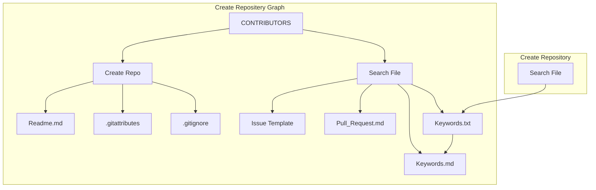
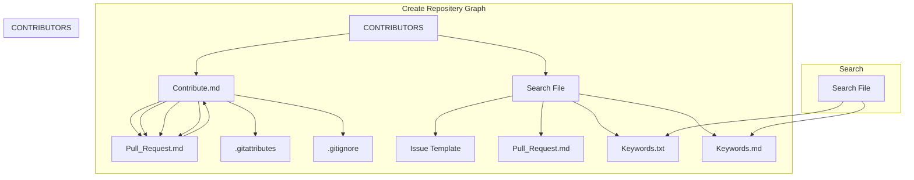
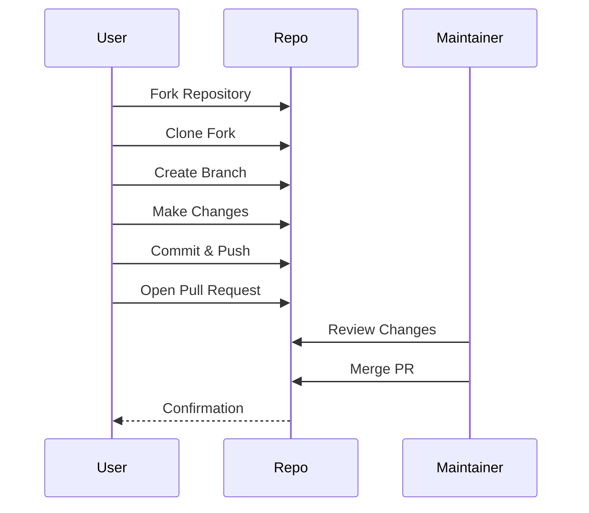
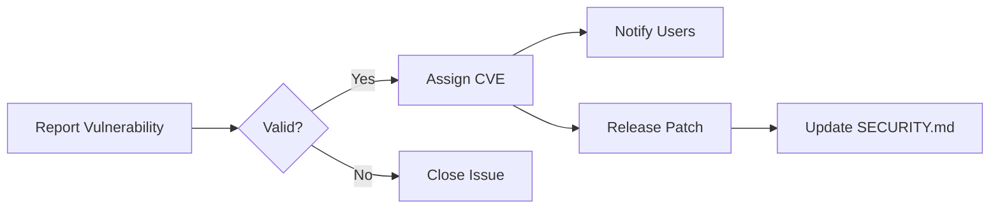
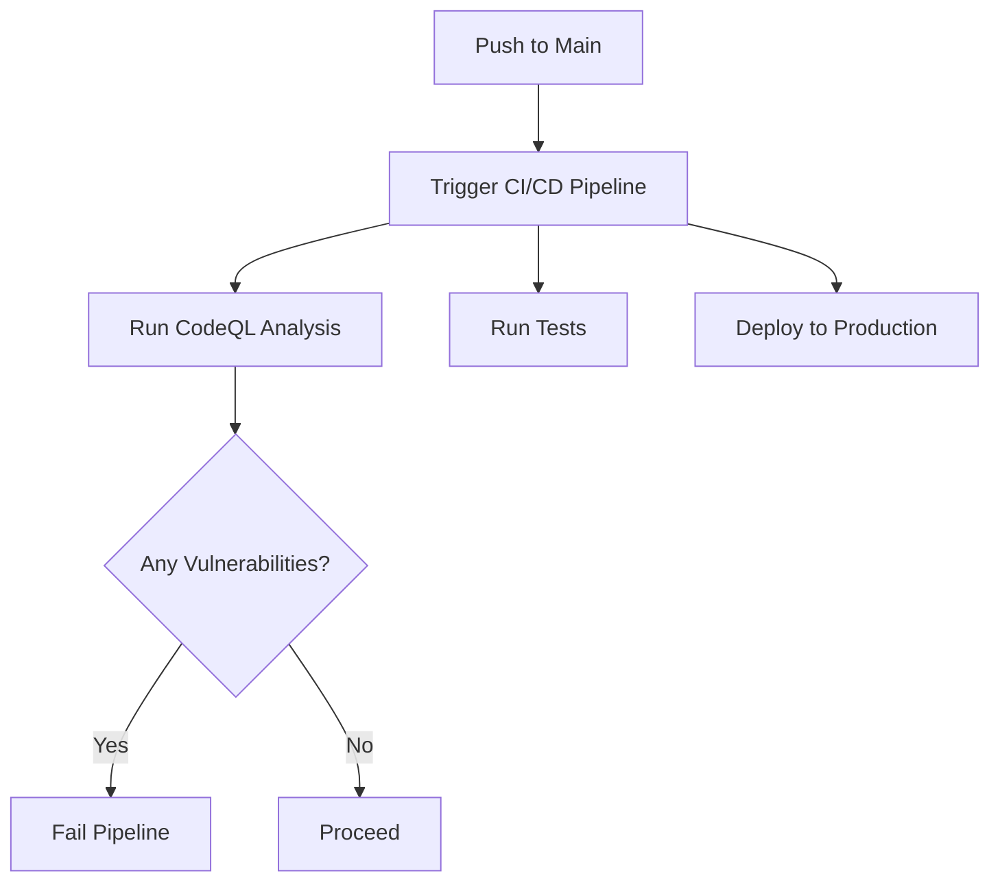
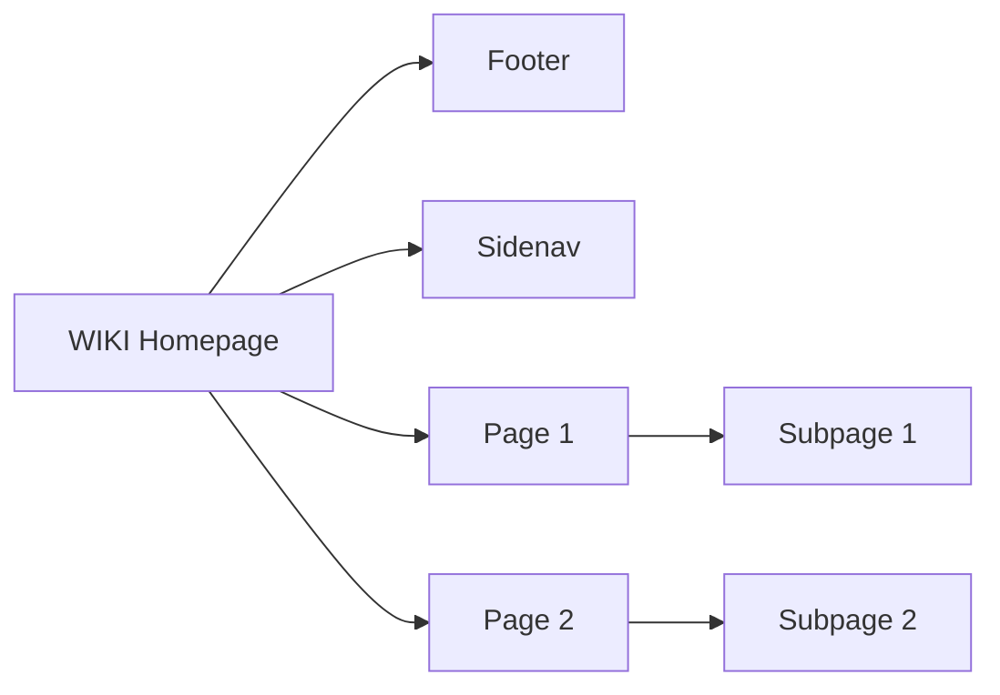
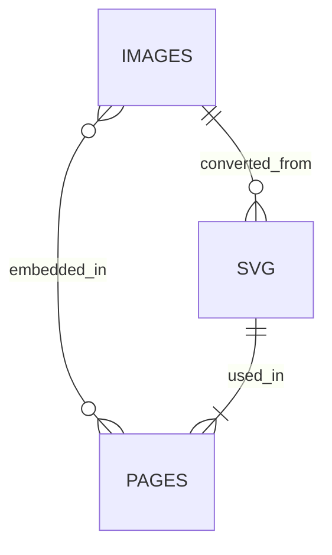
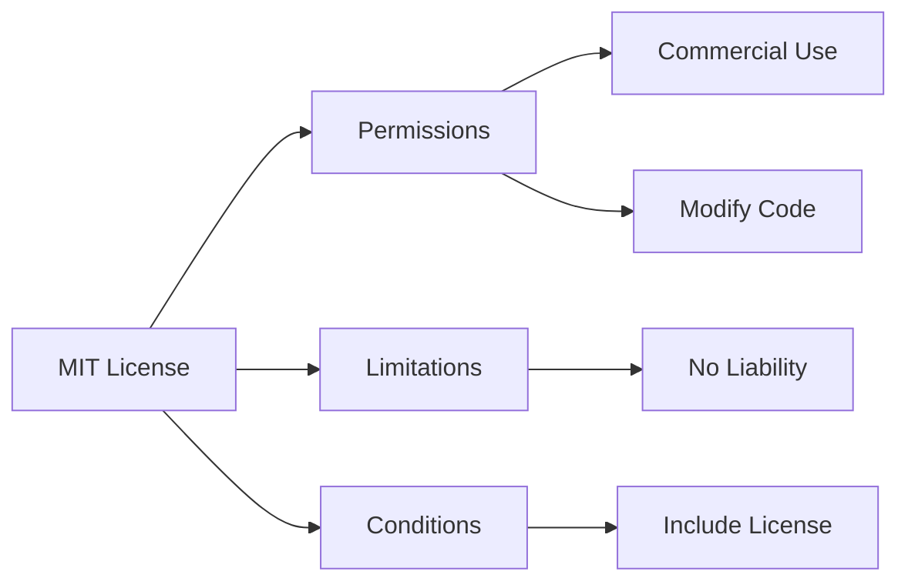
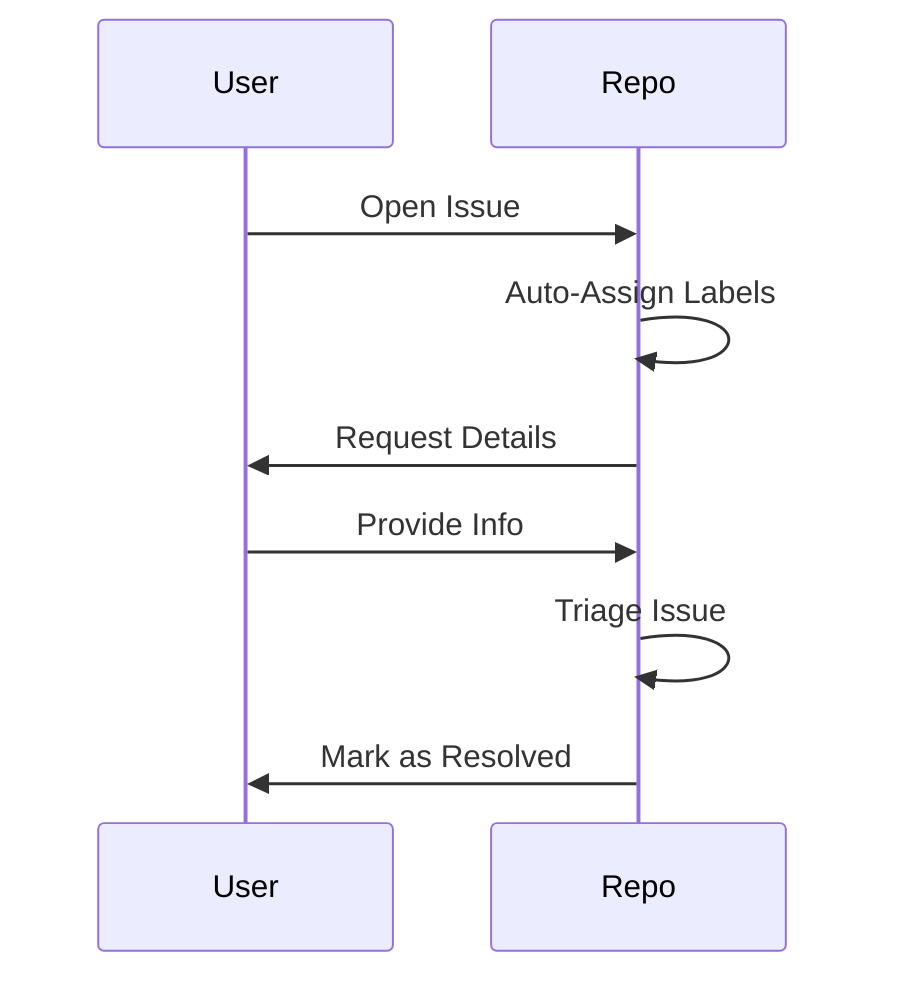

Here’s a **Mermaid diagram** representation of your GitHub repository structure and workflows. I’ll use **flowcharts** and **sequence diagrams** to visualize the hierarchy and processes:

---

### **1. Repository Structure (Directory Tree)**
**Diagram Type**: Flowchart  

---

### **2. Contribution Workflow**
**Diagram Type**: Sequence Diagram  

---

### **3. Security Policy Workflow**
**Diagram Type**: Flowchart  

---

### **4. GitHub Actions Workflow (YML)**
**Diagram Type**: Flowchart  

---

### **5. WIKI Navigation**
**Diagram Type**: Flowchart  

---

### **6. Assets Management**
**Diagram Type**: Entity-Relationship Diagram (ERD)  

---

### **7. License & Compliance**
**Diagram Type**: Flowchart  

---

### **8. Issue Tracking Process**
**Diagram Type**: Sequence Diagram  

---

### **Key Features Used**:
- **Subgraphs**: Group related files (e.g., `Repo Introduction`, `CONTRIBUTORS`).  
- **Directionality**: `TD` (top-down) for hierarchy, `LR` (left-right) for workflows.  
- **Styling**: Use `style Node fill:#f00` to highlight critical files (e.g., `SECURITY.md`).  

Let me know if you’d like to refine any diagram or add specific use cases! 🚀