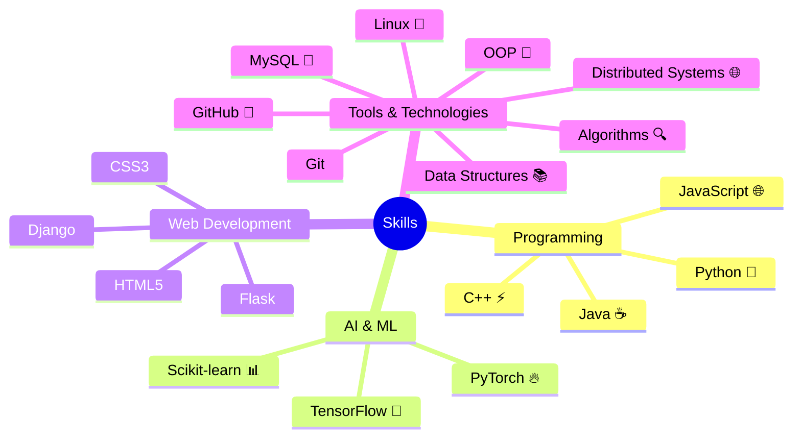
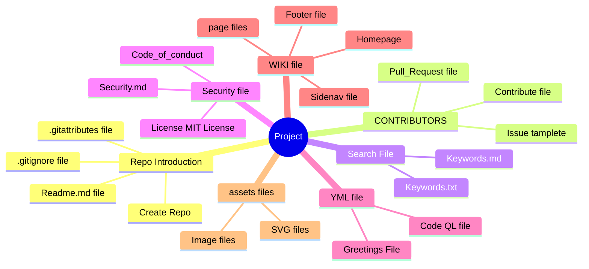

# Web-Designing-IWP

```mermaid
mindmap
  root((Skills))
    Programming
      Python 🐍
      C++ ⚡
      Java ☕
      JavaScript 🌐
    AI & ML
      TensorFlow 🧠
      PyTorch 🔥
      Scikit-learn 📊
    Web Development
      HTML5
      CSS3
      Flask
      Django
    Tools & Technologies
      GitHub 📂
      Git
      Linux 🐧
      MySQL 💾
      Data Structures 📚
      Algorithms 🔍
      OOP 🎯
      Distributed Systems 🌐
```

```mermaid
mindmap
root((Project))
     Repo Introduction
          Create Repo
          Readme.md file
          .gitattributes file
          .gitignore file
     CONTRIBUTORS
          Contribute file
          Issue tamplete
          Pull_Request file
     Search File
          Keywords.txt
          Keywords.md  
     Security file
          License MIT License     
          Code_of_conduct
          Security.md
     YML file
          Greetings File
          Code QL file
     WIKI file
          Homepage
          Footer file
          Sidenav file
          page files
     assets files
          Image files
          SVG files
```
