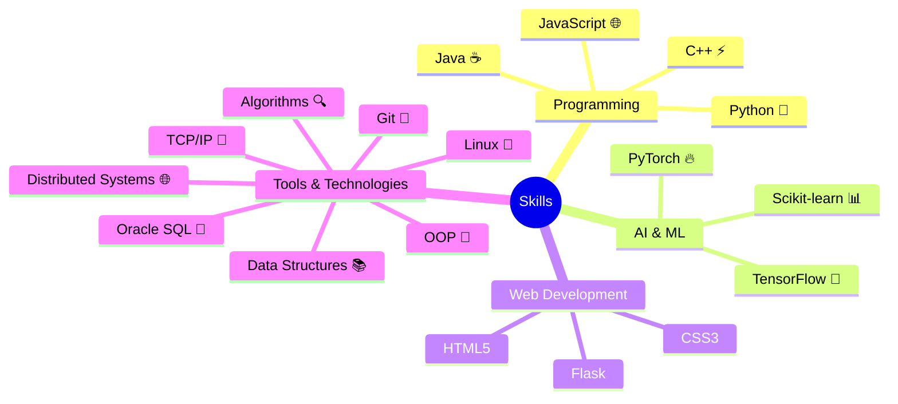

# Web-Designing-IWP

```mermaid
mindmap
  root((Skills))
    Programming
      Python 🐍
      C++ ⚡
      Java ☕
      JavaScript 🌐
    AI & ML
      TensorFlow 🧠
      PyTorch 🔥
      Scikit-learn 📊
    Web Development
      HTML5
      CSS3
      Flask
    Tools & Technologies
      Git 📂
      Linux 🐧
      Oracle SQL 💾
      Data Structures 📚
      Algorithms 🔍
      OOP 🎯
      Distributed Systems 🌐
      TCP/IP 🔌
```
